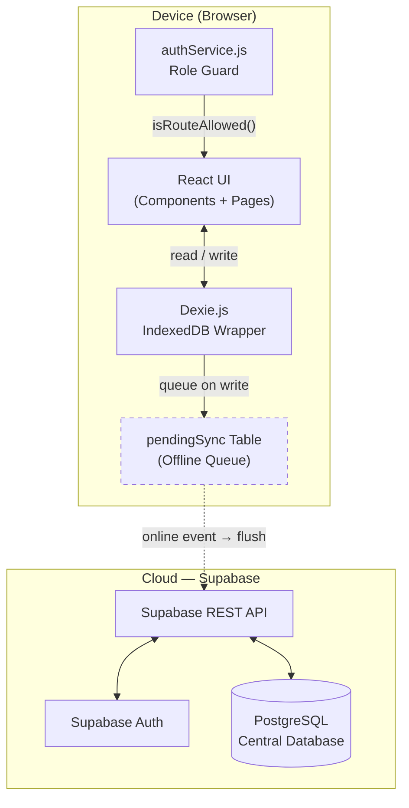

SIMAP Digital is built around a single architectural principle: **the app must work perfectly without internet access**. This page explains how every layer of the stack is designed to uphold that guarantee, from local data writes through cloud synchronisation.

## The offline-first paradigm

Traditional web apps treat the server as the source of truth. Offline-first apps invert that model — **the local store is the source of truth**, and the server is a durable replica.

When a cobrador processes a payment in a hillside community with no cellular signal:

1. The write goes straight to **IndexedDB** on the device — sub-millisecond, no network needed.
2. A corresponding record is added to the **`pendingSync` queue** inside the same IndexedDB database.
3. The UI reflects the new state immediately — no spinners, no errors.
4. Hours later, when the device comes back online, the queue is flushed to **Supabase** automatically.

<Note>
  The pending-sync pattern means the cobrador never has to think about connectivity. The app behaves identically whether the device is online or offline — the only difference is when data reaches the cloud.
</Note>

## Architecture diagram



## Technology stack

<Tabs>
  <Tab title="Runtime">
    | Layer | Technology | Version | Purpose |
    |---|---|---|---|
    | Frontend | React + React Router | 19.x / 7.x | Component-based SPA with hash-based routing |
    | Build tool | Vite + `@vitejs/plugin-react` | 8.x | Fast HMR dev server and optimised production bundle |
    | Local DB | Dexie.js (IndexedDB wrapper) | 4.x | Offline-first persistence with versioned schema migrations |
    | Cloud backend | Supabase (`@supabase/supabase-js`) | 2.x | PostgreSQL database, Auth, and REST API |
    | Excel export | SheetJS (xlsx) | 0.18.x | Client-side `.xlsx` generation — no server required |
    | PDF generation | jsPDF + jsPDF-AutoTable | 4.x / 5.x | Signed payment receipts and official MINSA reports |
  </Tab>
  <Tab title="Dev tooling">
    | Tool | Version | Purpose |
    |---|---|---|
    | ESLint | 10.x | Code quality with `react-hooks` and `react-refresh` plugins |
    | `@types/react` | 19.x | TypeScript type hints in JSX (JS project with IDE support) |
    | `canvas` | 3.x | Server-side canvas polyfill for PDF generation in Node test contexts |
  </Tab>
</Tabs>

## Sync strategy

The five-step sync lifecycle ensures no data loss regardless of connection quality:

<Steps>
  <Step title="Local write">
    Every user action (payment, expense, jornal, user registration) is written to IndexedDB through a Dexie service function (e.g., `pagosService.js`, `gastosService.js`). The write is synchronous from the UI's perspective — it resolves before any network call is attempted.
  </Step>

  <Step title="Queue pendingSync record">
    Immediately after the local write, a corresponding record is inserted into the `pendingSync` table with `type`, `payload`, and `timestamp` fields. This record acts as the work item for the sync worker.

    ```js
    // Simplified example from syncService.js
    await db.pendingSync.add({
      type: 'pago',
      payload: pagoRecord,
      timestamp: Date.now(),
    });
    ```
  </Step>

  <Step title="Detect online event">
    `syncService.js` listens to the browser's `window.addEventListener('online', ...)` event. On app load, if a Supabase session exists in `sessionStorage`, an initial sync is also triggered immediately.

    ```js
    // From App.jsx — triggered on mount
    const session = sessionStorage.getItem('simap_session');
    if (session) {
      import('./services/syncService').then(({ syncFromSupabase }) => {
        syncFromSupabase();
      });
    }
    ```
  </Step>

  <Step title="Push to Supabase">
    The sync worker iterates through all `pendingSync` records in chronological order and upserts each payload to the corresponding Supabase table via the REST API. Requests are made sequentially to respect foreign-key ordering.
  </Step>

  <Step title="Mark as synced">
    On a successful Supabase response, the `pendingSync` record is deleted from IndexedDB. If a request fails (e.g., the connection drops mid-sync), the record remains in the queue and will be retried on the next `online` event.
  </Step>
</Steps>

## Role-based access control (RBAC)

Route-level access is enforced by two functions exported from `src/services/authService.js`:

- **`isRouteAllowed(role, pathname)`** — returns `true` if the given role may access that path.
- **`getHomeRoute(role)`** — returns the default landing route for a role.

The `ProtectedRoute` component in `App.jsx` wraps every authenticated route. If a user navigates to a forbidden path, they are immediately redirected to their own home route — no flash of forbidden content.

```
┌─────────────┬──────────────────────────────────────────────────────────┐
│ Role        │ Permitted Routes                                         │
├─────────────┼──────────────────────────────────────────────────────────┤
│ admin       │ /admin, /puntos-admin                                    │
├─────────────┼──────────────────────────────────────────────────────────┤
│ cobrador    │ /cobros, /jornales, /gastos, /comisiones, /reporte,      │
│             │ /foro, /chat, /mapa                                      │
├─────────────┼──────────────────────────────────────────────────────────┤
│ minsa       │ /reporte (read-only download only)                       │
├─────────────┼──────────────────────────────────────────────────────────┤
│ cliente     │ /historial, /foro, /chat                                 │
├─────────────┼──────────────────────────────────────────────────────────┤
│ dev         │ /admin (audit log tab only — no financial data)          │
└─────────────┴──────────────────────────────────────────────────────────┘
```

## Module overview

| Module | Source file | Responsibility |
|---|---|---|
| **Payments** | `src/services/pagosService.js` | Register payments (monthly, daily, multi-month, partial, advance, catch-up); calculate resident status (Al día / Moroso / Corte); SHA-256 receipt hashing. |
| **Points / Gamification** | `src/services/puntosService.js` | Award points for on-time payments (+5), advance months (+10), and jornales; redeem points as monetary discounts (1 pt = B/.0.10, max B/.1.50/month); quarterly and annual bonus detection. |
| **AI engine** | `src/services/aiService.js` | Score each household 0–100 using five risk factors; predict delinquency via composite formula; generate optimised collection queue; detect anomalies with Z-score analysis. |
| **Auth / RBAC** | `src/services/authService.js` | `isRouteAllowed()`, `getHomeRoute()`, session management — the single source of truth for access control. |
| **Commissions** | `src/services/comisionesService.js` | Calculate and record the cobrador/devs commission split (40 % / 60 %) per payment; query accumulated balances. |
| **Sync** | `src/services/syncService.js` | Flush `pendingSync` queue to Supabase on `online` events; pull latest cloud state into IndexedDB on login. |
| **Database** | `src/services/db.js` | Dexie instance `SIMAPDigital` with six versioned schema migrations; `initDB()` seed function; localStorage → IndexedDB migration utility. |
| **Reports** | `src/services/reportesService.js` | Generate the official MINSA financial report as an eight-sheet Excel workbook and PDF receipts with jsPDF. |

## Data versioning

Dexie's built-in schema migration system lets SIMAP Digital evolve its IndexedDB schema non-destructively. Each `db.version(n)` call adds new stores without touching existing data.

| Version | What was added |
|---|---|
| **1** | Core tables — `usuarios`, `pagos`, `saldos`, `gastos`, `jornales`, `pendingSync`, `config`, `registeredUsers` |
| **2** | `foro` — community announcement board |
| **3** | `juntas` (B2B water-board registry), `auditoria` (immutable audit log), `archivos` (file-hash metadata for receipt integrity) |
| **4** | `puntos_historial` — full transaction history for the gamification points ledger |
| **5** | `notificaciones` — per-user push notification inbox |
| **6** | `mensajes` — direct-message conversations between cobrador and residents (AI-suggested dialogue delivery) |

<Note>
  Dexie applies migrations lazily when the database is first opened on a device running an older schema version. This means a cobrador who hasn't opened the app in months will have their local database upgraded seamlessly on the next launch — no data loss, no manual intervention.
</Note>
