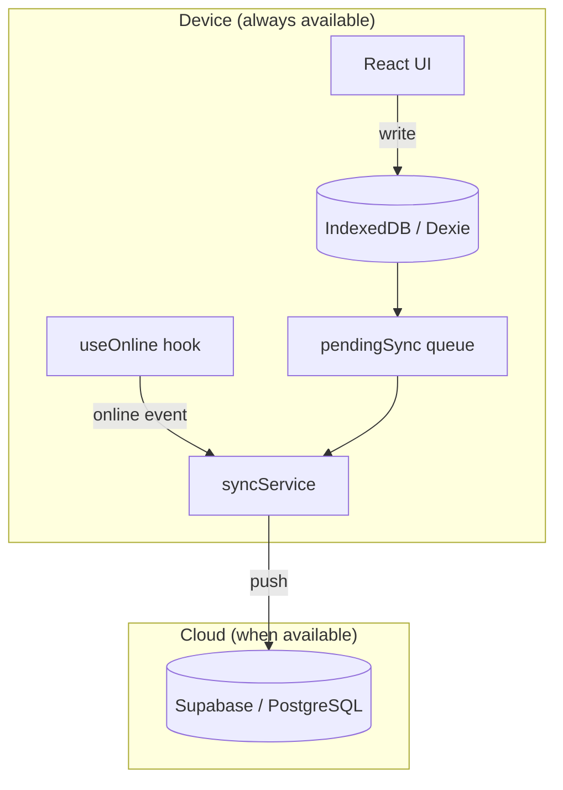

## Why offline-first?

Rural water board collectors — *cobradores* — operate across mountain communities in Panama where cell signal is unreliable or entirely absent. A collector visiting Sector Caballero Arriba on a Sunday morning cannot wait for a 4G connection to record a $3.00 monthly payment. The system must work on the device, in the field, right now.

SIMAP Digital solves this with an **offline-first architecture**: the local IndexedDB database is the primary source of truth at all times. The cloud (Supabase) is a sync target, not a dependency.

---

## How it works

Every user action follows the same path regardless of whether the device is online or offline:

1. **Write to IndexedDB first.** All creates and updates go directly to the local Dexie database — never blocked by network status.
2. **Queue the change.** A record is added to the `pendingSync` table marking the operation as outstanding.
3. **Detect connectivity.** The `useOnline` hook continuously monitors the browser's `online`/`offline` events.
4. **Push to Supabase.** When connectivity is restored, `syncService` reads the queue and pushes each pending record to the Supabase REST API.
5. **Confirm and clear.** Successfully synced records are marked `sincronizado` and removed from the queue.



---

## The `pendingSync` table

Every pending cloud operation is tracked as a row in `pendingSync`:

| Field | Type | Description |
|-------|------|-------------|
| `id` | auto-increment integer | Local primary key |
| `type` | string | Operation type — e.g. `"pago"`, `"gasto"`, `"jornal"` |
| `data` | object | Full payload to be sent to Supabase |
| `timestamp` | string (ISO 8601) | When the local record was created |

This table is defined as part of the Dexie v1 schema:

```js
pendingSync: '++id, type, timestamp'
```

---

## The `useOnline` hook

`useOnline` is a lightweight React hook that wraps the browser's native connectivity events and exposes a reactive boolean:

```js
// src/hooks/useOnline.js
import { useState, useEffect } from 'react';

export function useOnline() {
  const [isOnline, setIsOnline] = useState(navigator.onLine);

  useEffect(() => {
    const handleOnline  = () => setIsOnline(true);
    const handleOffline = () => setIsOnline(false);

    window.addEventListener('online',  handleOnline);
    window.addEventListener('offline', handleOffline);

    return () => {
      window.removeEventListener('online',  handleOnline);
      window.removeEventListener('offline', handleOffline);
    };
  }, []);

  return isOnline;
}
```

Any component can consume this hook to conditionally render a **"Sin Red"** banner or disable cloud-only actions. The sync engine also polls it before attempting to flush the queue.

---

## What works offline

The following operations are fully available with zero internet:

| Feature | Module |
|---------|--------|
| Recording monthly payment cobros | `pagosService.js` |
| Partial, multi-month, and advance payments | `pagosService.js` |
| Logging community work jornales | `jornalesService.js` |
| Registering expenses (gastos) | `gastosService.js` |
| Browsing and creating community forum posts | `foroService.js` |
| Generating PDF and Excel reports | `reportesService.js` (SheetJS, bundled) |
| Viewing a client's payment history | `db.pagos` |
| Checking and updating system configuration | `db.config` |

---

## What requires internet

A small number of operations depend on a live Supabase connection:

| Operation | Reason |
|-----------|--------|
| **Initial login** | Supabase Auth validates credentials and issues a session token |
| **First sync after login** | `syncFromSupabase()` downloads all users, pagos, saldos, and gastos to seed the local cache |
| **Cloud backup / multi-device sync** | Pending records in `pendingSync` are flushed to PostgreSQL |
| **New junta B2B registration** | `registerJunta()` creates rows in Supabase `juntas` table |

---

## Sync lifecycle

<Steps>
  <Step title="User performs an action offline">
    The cobrador records a payment. `pagosService` writes the record to `db.pagos` and adds a corresponding entry to `db.pendingSync` with `type: "pago"` and the full pago payload.
  </Step>
  <Step title="Device detects connectivity">
    `useOnline` fires the `online` event handler and sets `isOnline = true`. The UI removes the **"Sin Red"** indicator.
  </Step>
  <Step title="syncService flushes the queue">
    `pushToSupabase()` in `syncService.js` iterates over all pending records and calls `supabase.from('pagos').insert(...)` for each one, mapping local field names (e.g. `mesTarget`) to Supabase column names (e.g. `mes_target`).
  </Step>
  <Step title="Supabase confirms the write">
    On success, the record is marked `sincronizado`. On failure (e.g. network dropped mid-sync), it remains in `pendingSync` and will be retried on the next connectivity event.
  </Step>
  <Step title="Download latest state">
    After pushing, `syncFromSupabase()` pulls the latest `usuarios`, `pagos`, `saldos`, and `gastos` from Supabase and refreshes the local Dexie tables, ensuring any changes made on another device are reflected locally.
  </Step>
</Steps>

---

<Note>
**Security on logout.** When a user calls `logout()`, SIMAP Digital clears the three most sensitive local tables before ending the session:

```js
await db.usuarios.clear();
await db.pagos.clear();
await db.saldos.clear();
```

This ensures that no personally identifiable financial data persists in the browser's IndexedDB after the session ends — important when cobradores share devices or work in shared community spaces.
</Note>
