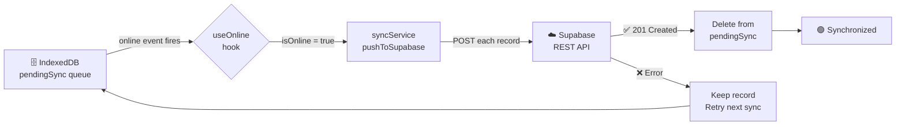

SIMAP Digital is built around a **write-local-first, sync-later** model. Every action a collector takes — registering a payment, logging a gasto, recording a jornal — is saved immediately to the browser's IndexedDB via Dexie.js. The app works identically with or without an internet connection. When connectivity is available, queued records are pushed to **Supabase PostgreSQL** in the background.

This architecture solves the core problem described in `docs/arquitectura.md`:

> *"When a collector goes house to house to collect water payments, they are usually in rural areas where there is no internet coverage or cell signal."*

---

## The Sync Model

```
Write to IndexedDB → Add to pendingSync → Detect online event → Push to Supabase → Remove from pendingSync
```

All data writes go to the local store first. The remote Supabase database is the **backup and collaboration layer**, not the primary source of truth during field operations.

### Why IndexedDB?

| Feature | IndexedDB (via Dexie.js) | localStorage |
|---|---|---|
| Storage capacity | Hundreds of MB | ~5–10 MB |
| Structured queries | ✅ Full query API | ❌ Key-value only |
| Async non-blocking | ✅ Promise-based | ❌ Synchronous |
| Works offline | ✅ | ✅ |

---

## The `pendingSync` Queue

Every local write that needs to reach the cloud creates an entry in the `pendingSync` store within IndexedDB. This acts as the outbox for all offline work. The entry shape varies slightly by service:

```js
// pagosService.js — payments use { type, data, timestamp }
{
  type:      'pago',
  data: {
    usuarioId: 'rodriguez_familia',
    tipo:      'mensual',
    mesTarget: '2026-03',
    fecha:     '2026-03-15T10:32:00.000Z',
    estado:    'completado'
  },
  timestamp: '2026-03-15T10:32:00.000Z'
}

// gastosService.js and jornalesService.js use { type, payload, timestamp }
{
  type:      'ADD_GASTO',
  payload:   { id: 'gst_...', monto: 45.50, desc: 'Tubería PVC', fecha: '...' },
  timestamp: 1710499920000
}
```

Records accumulate here until a successful push to Supabase confirms they are safe to remove.

---

## The `useOnline` Hook

Network status is tracked application-wide by `src/hooks/useOnline.js`, which registers listeners on the browser's native `online` and `offline` events:

```js
export function useOnline() {
  const [isOnline, setIsOnline] = useState(navigator.onLine);

  useEffect(() => {
    const handleOnline = () => setIsOnline(true);
    const handleOffline = () => setIsOnline(false);

    window.addEventListener('online', handleOnline);
    window.addEventListener('offline', handleOffline);

    return () => {
      window.removeEventListener('online', handleOnline);
      window.removeEventListener('offline', handleOffline);
    };
  }, []);

  return isOnline;
}
```

`isOnline` is a reactive boolean. Any component that needs to conditionally enable sync or display the connectivity badge consumes this hook.

---

## Sync Triggers

Synchronization is initiated in two situations:

| Trigger | When | Condition |
|---|---|---|
| **App load** | On initial render / page refresh | A valid session must exist in `authService` |
| **Network recovery** | When `useOnline` transitions from `false` → `true` | Any pending records exist in the queue |

There is no manual "sync now" button required — the process is fully automatic when conditions are met.

---

## Upload Sync (Device → Cloud)

`syncService.js` exposes `pushToSupabase(pago)`, which maps a local payment record to Supabase column names and inserts it:

```js
// syncService.js — pushToSupabase()
export async function pushToSupabase(pago) {
  const { data, error } = await supabase.from('pagos').insert({
    usuario_id: pago.usuarioId,
    tipo:       pago.tipo,
    mes_target: pago.mesTarget,
    fecha:      pago.fecha,
    estado:     pago.estado || 'completado'
  });
  return { success: !error, error };
}
```

If `error` is null the record can be removed from `pendingSync`. If the insert fails (network drop, Supabase timeout), the record stays in the queue and will be retried on the next sync trigger.

---

## Download Sync (Cloud → Device)

`syncService.js` also pulls canonical data from Supabase down to the local cache via `syncFromSupabase()`. This runs on app load when online and populates the local tables with the latest server state:

```js
// syncService.js — syncFromSupabase()
const { data: pagos } = await supabase.from('pagos').select('*');
if (pagos && pagos.length > 0) {
  const mappedPagos = pagos.map(p => ({
    ...p,
    idPago:    p.id_pago,
    usuarioId: p.usuario_id,
    mesTarget: p.mes_target
  }));
  await db.pagos.clear();
  await db.pagos.bulkAdd(mappedPagos);
}
```

Tables synced on download: `usuarios`, `pagos`, `saldos`, `gastos`.

---

## Sync Flow Diagram



---

## What Gets Synced

| Data Type | Local Table | Supabase Table | pendingSync type | Direction |
|---|---|---|---|---|
| Payments | `db.pagos` | `pagos` | `pago` | Both ↕ |
| Expenses | `db.gastos` | `gastos` | `ADD_GASTO` | Both ↕ |
| Work jornals | `db.jornales` | `jornales` | `ADD_JORNAL` | Push ↑ |
| Forum posts | `db.foro` | `foros` | `ADD_POST` | Push ↑ |
| User data | `db.usuarios` | `usuarios` | — | Pull ↓ |
| Account balances | `db.saldos` | `saldos` | — | Pull ↓ |

<Note>
Jornales, forum posts, and gastos are written to `pendingSync` locally but the current `syncFromSupabase()` download pass only fetches `usuarios`, `pagos`, `saldos`, and `gastos`. Jornals and forum posts are upload-only at this time.
</Note>

---

## The Sync Indicator in the Header

The app header displays live connectivity and sync status:

- **🔴 Sin Red** badge — shown when `useOnline()` returns `false`
- **Pending count** — number of records in `pendingSync` waiting to upload

This gives the collector immediate visual feedback that data is queued locally and not yet in the cloud.

---

## Data Security on Logout

When a user logs out, sensitive local tables are cleared to prevent another person picking up the device and accessing resident financial data:

```js
// On logout — data cleared from local cache
await db.usuarios.clear();
await db.pagos.clear();
await db.saldos.clear();
```

All three tables are re-populated from Supabase on the next authenticated login, so no data is lost — only the local cache is wiped.

---

## Conflict Resolution

<Note>
SIMAP uses a **last-write-wins** strategy for most records. Because the offline client is the single collector device for a given community, true write conflicts are rare. Each payment is assigned a unique `idPago` composed of a timestamp plus a random component (e.g., `1710499920000_r4f2a`), ensuring that concurrent inserts never collide on the primary key — even if two devices happen to sync simultaneously.
</Note>

---

## Collector Field Tip

<Tip>
Collectors can work an **entire day offline** — visiting every household in their sector, registering all payments and jornales locally — and then sync the full day's records in a single batch when they return to town and connect to Wi-Fi. There is no practical limit to how many records can queue in `pendingSync` before the upload.
</Tip>
